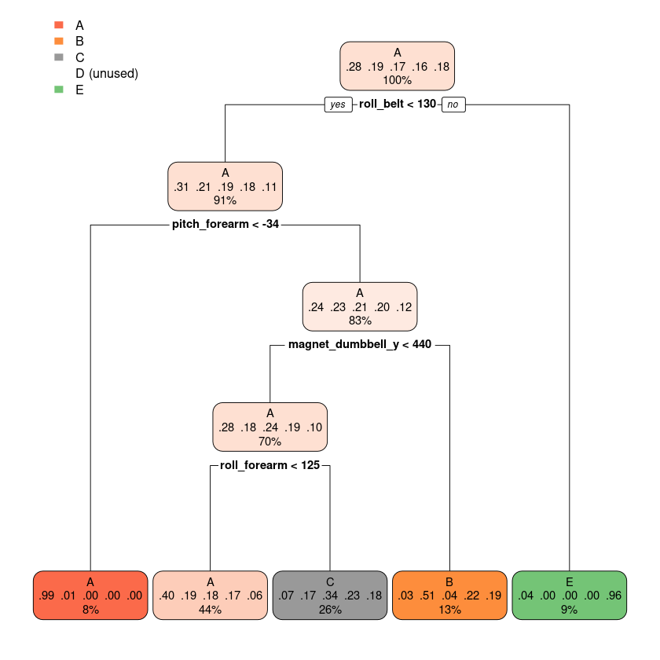

# **Course Project**

## **Background**
Using devices such as Jawbone Up, Nike FuelBand, and Fitbit it is now possible to collect a large amount of data about personal activity relatively inexpensively. These type of devices are part of the quantified self movement – a group of enthusiasts who take measurements about themselves regularly to improve their health, to find patterns in their behavior, or because they are tech geeks. One thing that people regularly do is quantify how much of a particular activity they do, but they rarely quantify how well they do it. In this project, your goal will be to use data from accelerometers on the belt, forearm, arm, and dumbell of 6 participants. They were asked to perform barbell lifts correctly and incorrectly in 5 different ways. More information is available from the website here: http://groupware.les.inf.puc-rio.br/har (see the section on the Weight Lifting Exercise Dataset). 

## **Data**

The training data for this project are available here: 

https://d396qusza40orc.cloudfront.net/predmachlearn/pml-training.csv

The test data are available here:

https://d396qusza40orc.cloudfront.net/predmachlearn/pml-testing.csv

The data for this project come from this source: http://groupware.les.inf.puc-rio.br/har. If you use the document you create for this class for any purpose please cite them as they have been very generous in allowing their data to be used for this kind of assignment. 

## **What you should submit**

The goal of your project is to predict the manner in which they did the exercise. This is the "classe" variable in the training set. You may use any of the other variables to predict with. You should create a report describing how you built your model, how you used cross validation, what you think the expected out of sample error is, and why you made the choices you did. You will also use your prediction model to predict 20 different test cases. 

## **Peer Review Portion**

Your submission for the Peer Review portion should consist of a link to a Github repo with your R markdown and compiled HTML file describing your analysis. Please constrain the text of the writeup to < 2000 words and the number of figures to be less than 5. It will make it easier for the graders if you submit a repo with a gh-pages branch so the HTML page can be viewed online (and you always want to make it easy on graders :-).

## **Course Project Prediction Quiz Portion**

Apply your machine learning algorithm to the 20 test cases available in the test data above and submit your predictions in appropriate format to the Course Project Prediction Quiz for automated grading. 

## **Reproducibility**

Due to security concerns with the exchange of R code, your code will not be run during the evaluation by your classmates. Please be sure that if they download the repo, they will be able to view the compiled HTML version of your analysis. 

## **Exploratory Data Analysis**


```R
library(caret)
library(rpart)
library(rpart.plot)
library(RColorBrewer)
library(randomForest)
library(gbm)
```

    Loading required package: lattice
    
    Loading required package: ggplot2
    
    randomForest 4.6-14
    
    Type rfNews() to see new features/changes/bug fixes.
    
    
    Attaching package: ‘randomForest’
    
    
    The following object is masked from ‘package:ggplot2’:
    
        margin
    
    
    Loaded gbm 2.1.8
    


```R
training_data <- read.csv('pml-training.csv')
testing_data <- read.csv('pml-testing.csv')
```


```R
head(training_data)
```


<table class="dataframe">
<caption>A data.frame: 6 × 160</caption>
<thead>
	<tr><th></th><th scope=col>X</th><th scope=col>user_name</th><th scope=col>raw_timestamp_part_1</th><th scope=col>raw_timestamp_part_2</th><th scope=col>cvtd_timestamp</th><th scope=col>new_window</th><th scope=col>num_window</th><th scope=col>roll_belt</th><th scope=col>pitch_belt</th><th scope=col>yaw_belt</th><th scope=col>⋯</th><th scope=col>gyros_forearm_x</th><th scope=col>gyros_forearm_y</th><th scope=col>gyros_forearm_z</th><th scope=col>accel_forearm_x</th><th scope=col>accel_forearm_y</th><th scope=col>accel_forearm_z</th><th scope=col>magnet_forearm_x</th><th scope=col>magnet_forearm_y</th><th scope=col>magnet_forearm_z</th><th scope=col>classe</th></tr>
	<tr><th></th><th scope=col>&lt;int&gt;</th><th scope=col>&lt;chr&gt;</th><th scope=col>&lt;int&gt;</th><th scope=col>&lt;int&gt;</th><th scope=col>&lt;chr&gt;</th><th scope=col>&lt;chr&gt;</th><th scope=col>&lt;int&gt;</th><th scope=col>&lt;dbl&gt;</th><th scope=col>&lt;dbl&gt;</th><th scope=col>&lt;dbl&gt;</th><th scope=col>⋯</th><th scope=col>&lt;dbl&gt;</th><th scope=col>&lt;dbl&gt;</th><th scope=col>&lt;dbl&gt;</th><th scope=col>&lt;int&gt;</th><th scope=col>&lt;int&gt;</th><th scope=col>&lt;int&gt;</th><th scope=col>&lt;int&gt;</th><th scope=col>&lt;dbl&gt;</th><th scope=col>&lt;dbl&gt;</th><th scope=col>&lt;chr&gt;</th></tr>
</thead>
<tbody>
	<tr><th scope=row>1</th><td>1</td><td>carlitos</td><td>1323084231</td><td>788290</td><td>05/12/2011 11:23</td><td>no</td><td>11</td><td>1.41</td><td>8.07</td><td>-94.4</td><td>⋯</td><td>0.03</td><td> 0.00</td><td>-0.02</td><td>192</td><td>203</td><td>-215</td><td>-17</td><td>654</td><td>476</td><td>A</td></tr>
	<tr><th scope=row>2</th><td>2</td><td>carlitos</td><td>1323084231</td><td>808298</td><td>05/12/2011 11:23</td><td>no</td><td>11</td><td>1.41</td><td>8.07</td><td>-94.4</td><td>⋯</td><td>0.02</td><td> 0.00</td><td>-0.02</td><td>192</td><td>203</td><td>-216</td><td>-18</td><td>661</td><td>473</td><td>A</td></tr>
	<tr><th scope=row>3</th><td>3</td><td>carlitos</td><td>1323084231</td><td>820366</td><td>05/12/2011 11:23</td><td>no</td><td>11</td><td>1.42</td><td>8.07</td><td>-94.4</td><td>⋯</td><td>0.03</td><td>-0.02</td><td> 0.00</td><td>196</td><td>204</td><td>-213</td><td>-18</td><td>658</td><td>469</td><td>A</td></tr>
	<tr><th scope=row>4</th><td>4</td><td>carlitos</td><td>1323084232</td><td>120339</td><td>05/12/2011 11:23</td><td>no</td><td>12</td><td>1.48</td><td>8.05</td><td>-94.4</td><td>⋯</td><td>0.02</td><td>-0.02</td><td> 0.00</td><td>189</td><td>206</td><td>-214</td><td>-16</td><td>658</td><td>469</td><td>A</td></tr>
	<tr><th scope=row>5</th><td>5</td><td>carlitos</td><td>1323084232</td><td>196328</td><td>05/12/2011 11:23</td><td>no</td><td>12</td><td>1.48</td><td>8.07</td><td>-94.4</td><td>⋯</td><td>0.02</td><td> 0.00</td><td>-0.02</td><td>189</td><td>206</td><td>-214</td><td>-17</td><td>655</td><td>473</td><td>A</td></tr>
	<tr><th scope=row>6</th><td>6</td><td>carlitos</td><td>1323084232</td><td>304277</td><td>05/12/2011 11:23</td><td>no</td><td>12</td><td>1.45</td><td>8.06</td><td>-94.4</td><td>⋯</td><td>0.02</td><td>-0.02</td><td>-0.03</td><td>193</td><td>203</td><td>-215</td><td> -9</td><td>660</td><td>478</td><td>A</td></tr>
</tbody>
</table>


```R
head(testing_data)
```


<table class="dataframe">
<caption>A data.frame: 6 × 160</caption>
<thead>
	<tr><th></th><th scope=col>X</th><th scope=col>user_name</th><th scope=col>raw_timestamp_part_1</th><th scope=col>raw_timestamp_part_2</th><th scope=col>cvtd_timestamp</th><th scope=col>new_window</th><th scope=col>num_window</th><th scope=col>roll_belt</th><th scope=col>pitch_belt</th><th scope=col>yaw_belt</th><th scope=col>⋯</th><th scope=col>gyros_forearm_x</th><th scope=col>gyros_forearm_y</th><th scope=col>gyros_forearm_z</th><th scope=col>accel_forearm_x</th><th scope=col>accel_forearm_y</th><th scope=col>accel_forearm_z</th><th scope=col>magnet_forearm_x</th><th scope=col>magnet_forearm_y</th><th scope=col>magnet_forearm_z</th><th scope=col>problem_id</th></tr>
	<tr><th></th><th scope=col>&lt;int&gt;</th><th scope=col>&lt;chr&gt;</th><th scope=col>&lt;int&gt;</th><th scope=col>&lt;int&gt;</th><th scope=col>&lt;chr&gt;</th><th scope=col>&lt;chr&gt;</th><th scope=col>&lt;int&gt;</th><th scope=col>&lt;dbl&gt;</th><th scope=col>&lt;dbl&gt;</th><th scope=col>&lt;dbl&gt;</th><th scope=col>⋯</th><th scope=col>&lt;dbl&gt;</th><th scope=col>&lt;dbl&gt;</th><th scope=col>&lt;dbl&gt;</th><th scope=col>&lt;int&gt;</th><th scope=col>&lt;int&gt;</th><th scope=col>&lt;int&gt;</th><th scope=col>&lt;int&gt;</th><th scope=col>&lt;int&gt;</th><th scope=col>&lt;int&gt;</th><th scope=col>&lt;int&gt;</th></tr>
</thead>
<tbody>
	<tr><th scope=row>1</th><td>1</td><td>pedro </td><td>1323095002</td><td>868349</td><td>05/12/2011 14:23</td><td>no</td><td> 74</td><td>123.00</td><td> 27.00</td><td> -4.75</td><td>⋯</td><td> 0.74</td><td>-3.34</td><td>-0.59</td><td>-110</td><td>267</td><td>-149</td><td>-714</td><td> 419</td><td>617</td><td>1</td></tr>
	<tr><th scope=row>2</th><td>2</td><td>jeremy</td><td>1322673067</td><td>778725</td><td>30/11/2011 17:11</td><td>no</td><td>431</td><td>  1.02</td><td>  4.87</td><td>-88.90</td><td>⋯</td><td> 1.12</td><td>-2.78</td><td>-0.18</td><td> 212</td><td>297</td><td>-118</td><td>-237</td><td> 791</td><td>873</td><td>2</td></tr>
	<tr><th scope=row>3</th><td>3</td><td>jeremy</td><td>1322673075</td><td>342967</td><td>30/11/2011 17:11</td><td>no</td><td>439</td><td>  0.87</td><td>  1.82</td><td>-88.50</td><td>⋯</td><td> 0.18</td><td>-0.79</td><td> 0.28</td><td> 154</td><td>271</td><td>-129</td><td> -51</td><td> 698</td><td>783</td><td>3</td></tr>
	<tr><th scope=row>4</th><td>4</td><td>adelmo</td><td>1322832789</td><td>560311</td><td>02/12/2011 13:33</td><td>no</td><td>194</td><td>125.00</td><td>-41.60</td><td>162.00</td><td>⋯</td><td> 1.38</td><td> 0.69</td><td> 1.80</td><td> -92</td><td>406</td><td> -39</td><td>-233</td><td> 783</td><td>521</td><td>4</td></tr>
	<tr><th scope=row>5</th><td>5</td><td>eurico</td><td>1322489635</td><td>814776</td><td>28/11/2011 14:13</td><td>no</td><td>235</td><td>  1.35</td><td>  3.33</td><td>-88.60</td><td>⋯</td><td>-0.75</td><td> 3.10</td><td> 0.80</td><td> 131</td><td>-93</td><td> 172</td><td> 375</td><td>-787</td><td> 91</td><td>5</td></tr>
	<tr><th scope=row>6</th><td>6</td><td>jeremy</td><td>1322673149</td><td>510661</td><td>30/11/2011 17:12</td><td>no</td><td>504</td><td> -5.92</td><td>  1.59</td><td>-87.70</td><td>⋯</td><td>-0.88</td><td> 4.26</td><td> 1.35</td><td> 230</td><td>322</td><td>-144</td><td>-300</td><td> 800</td><td>884</td><td>6</td></tr>
</tbody>
</table>


```R
dim(training_data)
dim(testing_data)
```


<style>
.list-inline {list-style: none; margin:0; padding: 0}
.list-inline>li {display: inline-block}
.list-inline>li:not(:last-child)::after {content: "\00b7"; padding: 0 .5ex}
</style>
<ol class=list-inline><li>19622</li><li>160</li></ol>


<style>
.list-inline {list-style: none; margin:0; padding: 0}
.list-inline>li {display: inline-block}
.list-inline>li:not(:last-child)::after {content: "\00b7"; padding: 0 .5ex}
</style>
<ol class=list-inline><li>20</li><li>160</li></ol>


## **Preprocessing**


```R
nonZero <- nearZeroVar(training_data)

training_data <- training_data[, -nonZero]
testing_data <- testing_data[, -nonZero]
```


```R
dim(training_data)
```


<style>
.list-inline {list-style: none; margin:0; padding: 0}
.list-inline>li {display: inline-block}
.list-inline>li:not(:last-child)::after {content: "\00b7"; padding: 0 .5ex}
</style>
<ol class=list-inline><li>19622</li><li>100</li></ol>


```R
nas <- sapply(training_data, function(x) mean(is.na(x))) > 0.95
```


```R
nas
```


<style>
.dl-inline {width: auto; margin:0; padding: 0}
.dl-inline>dt, .dl-inline>dd {float: none; width: auto; display: inline-block}
.dl-inline>dt::after {content: ":\0020"; padding-right: .5ex}
.dl-inline>dt:not(:first-of-type) {padding-left: .5ex}
</style><dl class=dl-inline><dt>X</dt><dd>FALSE</dd><dt>user_name</dt><dd>FALSE</dd><dt>raw_timestamp_part_1</dt><dd>FALSE</dd><dt>raw_timestamp_part_2</dt><dd>FALSE</dd><dt>cvtd_timestamp</dt><dd>FALSE</dd><dt>num_window</dt><dd>FALSE</dd><dt>roll_belt</dt><dd>FALSE</dd><dt>pitch_belt</dt><dd>FALSE</dd><dt>yaw_belt</dt><dd>FALSE</dd><dt>total_accel_belt</dt><dd>FALSE</dd><dt>max_roll_belt</dt><dd>TRUE</dd><dt>max_picth_belt</dt><dd>TRUE</dd><dt>min_roll_belt</dt><dd>TRUE</dd><dt>min_pitch_belt</dt><dd>TRUE</dd><dt>amplitude_roll_belt</dt><dd>TRUE</dd><dt>amplitude_pitch_belt</dt><dd>TRUE</dd><dt>var_total_accel_belt</dt><dd>TRUE</dd><dt>avg_roll_belt</dt><dd>TRUE</dd><dt>stddev_roll_belt</dt><dd>TRUE</dd><dt>var_roll_belt</dt><dd>TRUE</dd><dt>avg_pitch_belt</dt><dd>TRUE</dd><dt>stddev_pitch_belt</dt><dd>TRUE</dd><dt>var_pitch_belt</dt><dd>TRUE</dd><dt>avg_yaw_belt</dt><dd>TRUE</dd><dt>stddev_yaw_belt</dt><dd>TRUE</dd><dt>var_yaw_belt</dt><dd>TRUE</dd><dt>gyros_belt_x</dt><dd>FALSE</dd><dt>gyros_belt_y</dt><dd>FALSE</dd><dt>gyros_belt_z</dt><dd>FALSE</dd><dt>accel_belt_x</dt><dd>FALSE</dd><dt>accel_belt_y</dt><dd>FALSE</dd><dt>accel_belt_z</dt><dd>FALSE</dd><dt>magnet_belt_x</dt><dd>FALSE</dd><dt>magnet_belt_y</dt><dd>FALSE</dd><dt>magnet_belt_z</dt><dd>FALSE</dd><dt>roll_arm</dt><dd>FALSE</dd><dt>pitch_arm</dt><dd>FALSE</dd><dt>yaw_arm</dt><dd>FALSE</dd><dt>total_accel_arm</dt><dd>FALSE</dd><dt>var_accel_arm</dt><dd>TRUE</dd><dt>gyros_arm_x</dt><dd>FALSE</dd><dt>gyros_arm_y</dt><dd>FALSE</dd><dt>gyros_arm_z</dt><dd>FALSE</dd><dt>accel_arm_x</dt><dd>FALSE</dd><dt>accel_arm_y</dt><dd>FALSE</dd><dt>accel_arm_z</dt><dd>FALSE</dd><dt>magnet_arm_x</dt><dd>FALSE</dd><dt>magnet_arm_y</dt><dd>FALSE</dd><dt>magnet_arm_z</dt><dd>FALSE</dd><dt>max_picth_arm</dt><dd>TRUE</dd><dt>max_yaw_arm</dt><dd>TRUE</dd><dt>min_yaw_arm</dt><dd>TRUE</dd><dt>amplitude_yaw_arm</dt><dd>TRUE</dd><dt>roll_dumbbell</dt><dd>FALSE</dd><dt>pitch_dumbbell</dt><dd>FALSE</dd><dt>yaw_dumbbell</dt><dd>FALSE</dd><dt>max_roll_dumbbell</dt><dd>TRUE</dd><dt>max_picth_dumbbell</dt><dd>TRUE</dd><dt>min_roll_dumbbell</dt><dd>TRUE</dd><dt>min_pitch_dumbbell</dt><dd>TRUE</dd><dt>amplitude_roll_dumbbell</dt><dd>TRUE</dd><dt>amplitude_pitch_dumbbell</dt><dd>TRUE</dd><dt>total_accel_dumbbell</dt><dd>FALSE</dd><dt>var_accel_dumbbell</dt><dd>TRUE</dd><dt>avg_roll_dumbbell</dt><dd>TRUE</dd><dt>stddev_roll_dumbbell</dt><dd>TRUE</dd><dt>var_roll_dumbbell</dt><dd>TRUE</dd><dt>avg_pitch_dumbbell</dt><dd>TRUE</dd><dt>stddev_pitch_dumbbell</dt><dd>TRUE</dd><dt>var_pitch_dumbbell</dt><dd>TRUE</dd><dt>avg_yaw_dumbbell</dt><dd>TRUE</dd><dt>stddev_yaw_dumbbell</dt><dd>TRUE</dd><dt>var_yaw_dumbbell</dt><dd>TRUE</dd><dt>gyros_dumbbell_x</dt><dd>FALSE</dd><dt>gyros_dumbbell_y</dt><dd>FALSE</dd><dt>gyros_dumbbell_z</dt><dd>FALSE</dd><dt>accel_dumbbell_x</dt><dd>FALSE</dd><dt>accel_dumbbell_y</dt><dd>FALSE</dd><dt>accel_dumbbell_z</dt><dd>FALSE</dd><dt>magnet_dumbbell_x</dt><dd>FALSE</dd><dt>magnet_dumbbell_y</dt><dd>FALSE</dd><dt>magnet_dumbbell_z</dt><dd>FALSE</dd><dt>roll_forearm</dt><dd>FALSE</dd><dt>pitch_forearm</dt><dd>FALSE</dd><dt>yaw_forearm</dt><dd>FALSE</dd><dt>max_picth_forearm</dt><dd>TRUE</dd><dt>min_pitch_forearm</dt><dd>TRUE</dd><dt>amplitude_pitch_forearm</dt><dd>TRUE</dd><dt>total_accel_forearm</dt><dd>FALSE</dd><dt>var_accel_forearm</dt><dd>TRUE</dd><dt>gyros_forearm_x</dt><dd>FALSE</dd><dt>gyros_forearm_y</dt><dd>FALSE</dd><dt>gyros_forearm_z</dt><dd>FALSE</dd><dt>accel_forearm_x</dt><dd>FALSE</dd><dt>accel_forearm_y</dt><dd>FALSE</dd><dt>accel_forearm_z</dt><dd>FALSE</dd><dt>magnet_forearm_x</dt><dd>FALSE</dd><dt>magnet_forearm_y</dt><dd>FALSE</dd><dt>magnet_forearm_z</dt><dd>FALSE</dd><dt>classe</dt><dd>FALSE</dd></dl>


```R
training_data <- training_data[,nas == FALSE]
testing_data <- testing_data[,nas == FALSE]
```


```R
dim(training_data)
```


<style>
.list-inline {list-style: none; margin:0; padding: 0}
.list-inline>li {display: inline-block}
.list-inline>li:not(:last-child)::after {content: "\00b7"; padding: 0 .5ex}
</style>
<ol class=list-inline><li>19622</li><li>59</li></ol>


```R
summary(training_data)
```


           X          user_name         raw_timestamp_part_1 raw_timestamp_part_2
     Min.   :    1   Length:19622       Min.   :1.322e+09    Min.   :   294      
     1st Qu.: 4906   Class :character   1st Qu.:1.323e+09    1st Qu.:252912      
     Median : 9812   Mode  :character   Median :1.323e+09    Median :496380      
     Mean   : 9812                      Mean   :1.323e+09    Mean   :500656      
     3rd Qu.:14717                      3rd Qu.:1.323e+09    3rd Qu.:751891      
     Max.   :19622                      Max.   :1.323e+09    Max.   :998801      
     cvtd_timestamp       num_window      roll_belt        pitch_belt      
     Length:19622       Min.   :  1.0   Min.   :-28.90   Min.   :-55.8000  
     Class :character   1st Qu.:222.0   1st Qu.:  1.10   1st Qu.:  1.7600  
     Mode  :character   Median :424.0   Median :113.00   Median :  5.2800  
                        Mean   :430.6   Mean   : 64.41   Mean   :  0.3053  
                        3rd Qu.:644.0   3rd Qu.:123.00   3rd Qu.: 14.9000  
                        Max.   :864.0   Max.   :162.00   Max.   : 60.3000  
        yaw_belt       total_accel_belt  gyros_belt_x        gyros_belt_y     
     Min.   :-180.00   Min.   : 0.00    Min.   :-1.040000   Min.   :-0.64000  
     1st Qu.: -88.30   1st Qu.: 3.00    1st Qu.:-0.030000   1st Qu.: 0.00000  
     Median : -13.00   Median :17.00    Median : 0.030000   Median : 0.02000  
     Mean   : -11.21   Mean   :11.31    Mean   :-0.005592   Mean   : 0.03959  
     3rd Qu.:  12.90   3rd Qu.:18.00    3rd Qu.: 0.110000   3rd Qu.: 0.11000  
     Max.   : 179.00   Max.   :29.00    Max.   : 2.220000   Max.   : 0.64000  
      gyros_belt_z      accel_belt_x       accel_belt_y     accel_belt_z    
     Min.   :-1.4600   Min.   :-120.000   Min.   :-69.00   Min.   :-275.00  
     1st Qu.:-0.2000   1st Qu.: -21.000   1st Qu.:  3.00   1st Qu.:-162.00  
     Median :-0.1000   Median : -15.000   Median : 35.00   Median :-152.00  
     Mean   :-0.1305   Mean   :  -5.595   Mean   : 30.15   Mean   : -72.59  
     3rd Qu.:-0.0200   3rd Qu.:  -5.000   3rd Qu.: 61.00   3rd Qu.:  27.00  
     Max.   : 1.6200   Max.   :  85.000   Max.   :164.00   Max.   : 105.00  
     magnet_belt_x   magnet_belt_y   magnet_belt_z       roll_arm      
     Min.   :-52.0   Min.   :354.0   Min.   :-623.0   Min.   :-180.00  
     1st Qu.:  9.0   1st Qu.:581.0   1st Qu.:-375.0   1st Qu.: -31.77  
     Median : 35.0   Median :601.0   Median :-320.0   Median :   0.00  
     Mean   : 55.6   Mean   :593.7   Mean   :-345.5   Mean   :  17.83  
     3rd Qu.: 59.0   3rd Qu.:610.0   3rd Qu.:-306.0   3rd Qu.:  77.30  
     Max.   :485.0   Max.   :673.0   Max.   : 293.0   Max.   : 180.00  
       pitch_arm          yaw_arm          total_accel_arm  gyros_arm_x      
     Min.   :-88.800   Min.   :-180.0000   Min.   : 1.00   Min.   :-6.37000  
     1st Qu.:-25.900   1st Qu.: -43.1000   1st Qu.:17.00   1st Qu.:-1.33000  
     Median :  0.000   Median :   0.0000   Median :27.00   Median : 0.08000  
     Mean   : -4.612   Mean   :  -0.6188   Mean   :25.51   Mean   : 0.04277  
     3rd Qu.: 11.200   3rd Qu.:  45.8750   3rd Qu.:33.00   3rd Qu.: 1.57000  
     Max.   : 88.500   Max.   : 180.0000   Max.   :66.00   Max.   : 4.87000  
      gyros_arm_y       gyros_arm_z       accel_arm_x       accel_arm_y    
     Min.   :-3.4400   Min.   :-2.3300   Min.   :-404.00   Min.   :-318.0  
     1st Qu.:-0.8000   1st Qu.:-0.0700   1st Qu.:-242.00   1st Qu.: -54.0  
     Median :-0.2400   Median : 0.2300   Median : -44.00   Median :  14.0  
     Mean   :-0.2571   Mean   : 0.2695   Mean   : -60.24   Mean   :  32.6  
     3rd Qu.: 0.1400   3rd Qu.: 0.7200   3rd Qu.:  84.00   3rd Qu.: 139.0  
     Max.   : 2.8400   Max.   : 3.0200   Max.   : 437.00   Max.   : 308.0  
      accel_arm_z       magnet_arm_x     magnet_arm_y     magnet_arm_z   
     Min.   :-636.00   Min.   :-584.0   Min.   :-392.0   Min.   :-597.0  
     1st Qu.:-143.00   1st Qu.:-300.0   1st Qu.:  -9.0   1st Qu.: 131.2  
     Median : -47.00   Median : 289.0   Median : 202.0   Median : 444.0  
     Mean   : -71.25   Mean   : 191.7   Mean   : 156.6   Mean   : 306.5  
     3rd Qu.:  23.00   3rd Qu.: 637.0   3rd Qu.: 323.0   3rd Qu.: 545.0  
     Max.   : 292.00   Max.   : 782.0   Max.   : 583.0   Max.   : 694.0  
     roll_dumbbell     pitch_dumbbell     yaw_dumbbell      total_accel_dumbbell
     Min.   :-153.71   Min.   :-149.59   Min.   :-150.871   Min.   : 0.00       
     1st Qu.: -18.49   1st Qu.: -40.89   1st Qu.: -77.644   1st Qu.: 4.00       
     Median :  48.17   Median : -20.96   Median :  -3.324   Median :10.00       
     Mean   :  23.84   Mean   : -10.78   Mean   :   1.674   Mean   :13.72       
     3rd Qu.:  67.61   3rd Qu.:  17.50   3rd Qu.:  79.643   3rd Qu.:19.00       
     Max.   : 153.55   Max.   : 149.40   Max.   : 154.952   Max.   :58.00       
     gyros_dumbbell_x    gyros_dumbbell_y   gyros_dumbbell_z  accel_dumbbell_x 
     Min.   :-204.0000   Min.   :-2.10000   Min.   : -2.380   Min.   :-419.00  
     1st Qu.:  -0.0300   1st Qu.:-0.14000   1st Qu.: -0.310   1st Qu.: -50.00  
     Median :   0.1300   Median : 0.03000   Median : -0.130   Median :  -8.00  
     Mean   :   0.1611   Mean   : 0.04606   Mean   : -0.129   Mean   : -28.62  
     3rd Qu.:   0.3500   3rd Qu.: 0.21000   3rd Qu.:  0.030   3rd Qu.:  11.00  
     Max.   :   2.2200   Max.   :52.00000   Max.   :317.000   Max.   : 235.00  
     accel_dumbbell_y  accel_dumbbell_z  magnet_dumbbell_x magnet_dumbbell_y
     Min.   :-189.00   Min.   :-334.00   Min.   :-643.0    Min.   :-3600    
     1st Qu.:  -8.00   1st Qu.:-142.00   1st Qu.:-535.0    1st Qu.:  231    
     Median :  41.50   Median :  -1.00   Median :-479.0    Median :  311    
     Mean   :  52.63   Mean   : -38.32   Mean   :-328.5    Mean   :  221    
     3rd Qu.: 111.00   3rd Qu.:  38.00   3rd Qu.:-304.0    3rd Qu.:  390    
     Max.   : 315.00   Max.   : 318.00   Max.   : 592.0    Max.   :  633    
     magnet_dumbbell_z  roll_forearm       pitch_forearm     yaw_forearm     
     Min.   :-262.00   Min.   :-180.0000   Min.   :-72.50   Min.   :-180.00  
     1st Qu.: -45.00   1st Qu.:  -0.7375   1st Qu.:  0.00   1st Qu.: -68.60  
     Median :  13.00   Median :  21.7000   Median :  9.24   Median :   0.00  
     Mean   :  46.05   Mean   :  33.8265   Mean   : 10.71   Mean   :  19.21  
     3rd Qu.:  95.00   3rd Qu.: 140.0000   3rd Qu.: 28.40   3rd Qu.: 110.00  
     Max.   : 452.00   Max.   : 180.0000   Max.   : 89.80   Max.   : 180.00  
     total_accel_forearm gyros_forearm_x   gyros_forearm_y     gyros_forearm_z   
     Min.   :  0.00      Min.   :-22.000   Min.   : -7.02000   Min.   : -8.0900  
     1st Qu.: 29.00      1st Qu.: -0.220   1st Qu.: -1.46000   1st Qu.: -0.1800  
     Median : 36.00      Median :  0.050   Median :  0.03000   Median :  0.0800  
     Mean   : 34.72      Mean   :  0.158   Mean   :  0.07517   Mean   :  0.1512  
     3rd Qu.: 41.00      3rd Qu.:  0.560   3rd Qu.:  1.62000   3rd Qu.:  0.4900  
     Max.   :108.00      Max.   :  3.970   Max.   :311.00000   Max.   :231.0000  
     accel_forearm_x   accel_forearm_y  accel_forearm_z   magnet_forearm_x 
     Min.   :-498.00   Min.   :-632.0   Min.   :-446.00   Min.   :-1280.0  
     1st Qu.:-178.00   1st Qu.:  57.0   1st Qu.:-182.00   1st Qu.: -616.0  
     Median : -57.00   Median : 201.0   Median : -39.00   Median : -378.0  
     Mean   : -61.65   Mean   : 163.7   Mean   : -55.29   Mean   : -312.6  
     3rd Qu.:  76.00   3rd Qu.: 312.0   3rd Qu.:  26.00   3rd Qu.:  -73.0  
     Max.   : 477.00   Max.   : 923.0   Max.   : 291.00   Max.   :  672.0  
     magnet_forearm_y magnet_forearm_z    classe         
     Min.   :-896.0   Min.   :-973.0   Length:19622      
     1st Qu.:   2.0   1st Qu.: 191.0   Class :character  
     Median : 591.0   Median : 511.0   Mode  :character  
     Mean   : 380.1   Mean   : 393.6                     
     3rd Qu.: 737.0   3rd Qu.: 653.0                     
     Max.   :1480.0   Max.   :1090.0                     


```R
chars <- sapply(training_data, is.character)
```


```R
training_data <- subset(training_data, select = -c(X, user_name, cvtd_timestamp))
```

### **Data Partitioning**


```R
partition <- createDataPartition(training_data$classe, p=0.6, list=FALSE)
training_data <- training_data[partition,]
testing_data <- training_data[-partition,]

dim(training_data)
```


<style>
.list-inline {list-style: none; margin:0; padding: 0}
.list-inline>li {display: inline-block}
.list-inline>li:not(:last-child)::after {content: "\00b7"; padding: 0 .5ex}
</style>
<ol class=list-inline><li>11776</li><li>56</li></ol>


```R
dim(testing_data)
```


<style>
.list-inline {list-style: none; margin:0; padding: 0}
.list-inline>li {display: inline-block}
.list-inline>li:not(:last-child)::after {content: "\00b7"; padding: 0 .5ex}
</style>
<ol class=list-inline><li>4710</li><li>56</li></ol>


### **Models**


```R
model <- train(classe ~ ., data = training_data, method="rpart")
```


```R
pred <- predict(model, testing_data)
```


```R
confusionMatrix(pred, as.factor(testing_data$classe))

```


    Confusion Matrix and Statistics
    
              Reference
    Prediction    A    B    C    D    E
             A 1217  406  374  360  112
             B   15  308   24  126  123
             C   96  191  428  283  221
             D    0    0    0    0    0
             E   17    0    0    0  409
    
    Overall Statistics
                                              
                   Accuracy : 0.5015          
                     95% CI : (0.4871, 0.5159)
        No Information Rate : 0.2856          
        P-Value [Acc > NIR] : < 2.2e-16       
                                              
                      Kappa : 0.3475          
                                              
     Mcnemar's Test P-Value : NA              
    
    Statistics by Class:
    
                         Class: A Class: B Class: C Class: D Class: E
    Sensitivity            0.9048  0.34033  0.51816   0.0000  0.47283
    Specificity            0.6279  0.92431  0.79634   1.0000  0.99558
    Pos Pred Value         0.4929  0.51678  0.35111      NaN  0.96009
    Neg Pred Value         0.9429  0.85489  0.88599   0.8367  0.89356
    Prevalence             0.2856  0.19214  0.17537   0.1633  0.18365
    Detection Rate         0.2584  0.06539  0.09087   0.0000  0.08684
    Detection Prevalence   0.5242  0.12654  0.25881   0.0000  0.09045
    Balanced Accuracy      0.7664  0.63232  0.65725   0.5000  0.73421


```R
rpart.plot(model$finalModel, roundint = FALSE)
```


    

    


```R
model_2 <- train(classe ~ ., data = training_data, method = "rf", ntree = 50)
```


```R
pred1 <- predict(model_2, testing_data)
RF_CM <- confusionMatrix(pred1, as.factor(testing_data$classe))
RF_CM
```


    Confusion Matrix and Statistics
    
              Reference
    Prediction    A    B    C    D    E
             A 1345    0    0    0    0
             B    0  905    0    0    0
             C    0    0  826    0    0
             D    0    0    0  769    0
             E    0    0    0    0  865
    
    Overall Statistics
                                         
                   Accuracy : 1          
                     95% CI : (0.9992, 1)
        No Information Rate : 0.2856     
        P-Value [Acc > NIR] : < 2.2e-16  
                                         
                      Kappa : 1          
                                         
     Mcnemar's Test P-Value : NA         
    
    Statistics by Class:
    
                         Class: A Class: B Class: C Class: D Class: E
    Sensitivity            1.0000   1.0000   1.0000   1.0000   1.0000
    Specificity            1.0000   1.0000   1.0000   1.0000   1.0000
    Pos Pred Value         1.0000   1.0000   1.0000   1.0000   1.0000
    Neg Pred Value         1.0000   1.0000   1.0000   1.0000   1.0000
    Prevalence             0.2856   0.1921   0.1754   0.1633   0.1837
    Detection Rate         0.2856   0.1921   0.1754   0.1633   0.1837
    Detection Prevalence   0.2856   0.1921   0.1754   0.1633   0.1837
    Balanced Accuracy      1.0000   1.0000   1.0000   1.0000   1.0000


```R
model_3 <- train(classe ~ ., data = training_data, method = "gbm", verbose = FALSE)
```


```R
pred2 <- predict(model_3, testing_data)
GBM_CM <- confusionMatrix(pred2, as.factor(testing_data$classe))
GBM_CM
```


    Confusion Matrix and Statistics
    
              Reference
    Prediction    A    B    C    D    E
             A 1345    0    0    0    0
             B    0  905    3    0    0
             C    0    0  821    3    0
             D    0    0    2  766    0
             E    0    0    0    0  865
    
    Overall Statistics
                                              
                   Accuracy : 0.9983          
                     95% CI : (0.9967, 0.9993)
        No Information Rate : 0.2856          
        P-Value [Acc > NIR] : < 2.2e-16       
                                              
                      Kappa : 0.9979          
                                              
     Mcnemar's Test P-Value : NA              
    
    Statistics by Class:
    
                         Class: A Class: B Class: C Class: D Class: E
    Sensitivity            1.0000   1.0000   0.9939   0.9961   1.0000
    Specificity            1.0000   0.9992   0.9992   0.9995   1.0000
    Pos Pred Value         1.0000   0.9967   0.9964   0.9974   1.0000
    Neg Pred Value         1.0000   1.0000   0.9987   0.9992   1.0000
    Prevalence             0.2856   0.1921   0.1754   0.1633   0.1837
    Detection Rate         0.2856   0.1921   0.1743   0.1626   0.1837
    Detection Prevalence   0.2856   0.1928   0.1749   0.1631   0.1837
    Balanced Accuracy      1.0000   0.9996   0.9966   0.9978   1.0000


```R
RF_CM$overall
```


<style>
.dl-inline {width: auto; margin:0; padding: 0}
.dl-inline>dt, .dl-inline>dd {float: none; width: auto; display: inline-block}
.dl-inline>dt::after {content: ":\0020"; padding-right: .5ex}
.dl-inline>dt:not(:first-of-type) {padding-left: .5ex}
</style><dl class=dl-inline><dt>Accuracy</dt><dd>1</dd><dt>Kappa</dt><dd>1</dd><dt>AccuracyLower</dt><dd>0.999217105039691</dd><dt>AccuracyUpper</dt><dd>1</dd><dt>AccuracyNull</dt><dd>0.285562632696391</dd><dt>AccuracyPValue</dt><dd>0</dd><dt>McnemarPValue</dt><dd>NaN</dd></dl>


```R
GBM_CM$overall
```


<style>
.dl-inline {width: auto; margin:0; padding: 0}
.dl-inline>dt, .dl-inline>dd {float: none; width: auto; display: inline-block}
.dl-inline>dt::after {content: ":\0020"; padding-right: .5ex}
.dl-inline>dt:not(:first-of-type) {padding-left: .5ex}
</style><dl class=dl-inline><dt>Accuracy</dt><dd>0.998301486199575</dd><dt>Kappa</dt><dd>0.997851019288699</dd><dt>AccuracyLower</dt><dd>0.996656008367532</dd><dt>AccuracyUpper</dt><dd>0.999266426056025</dd><dt>AccuracyNull</dt><dd>0.285562632696391</dd><dt>AccuracyPValue</dt><dd>0</dd><dt>McnemarPValue</dt><dd>NaN</dd></dl>


## **Conclusion**

The Random Forest Model has a perfect accuracy of 1, so we will use this model for the final prediction


```R
final_pred <- read.csv('pml-testing.csv')
```


```R
predict(model_2, final_pred)
```


<style>
.list-inline {list-style: none; margin:0; padding: 0}
.list-inline>li {display: inline-block}
.list-inline>li:not(:last-child)::after {content: "\00b7"; padding: 0 .5ex}
</style>
<ol class=list-inline><li>B</li><li>A</li><li>B</li><li>A</li><li>A</li><li>E</li><li>D</li><li>B</li><li>A</li><li>A</li><li>B</li><li>C</li><li>B</li><li>A</li><li>E</li><li>E</li><li>A</li><li>B</li><li>B</li><li>B</li></ol>

<details>
	<summary style=display:list-item;cursor:pointer>
		<strong>Levels</strong>:
	</summary>
	<style>
	.list-inline {list-style: none; margin:0; padding: 0}
	.list-inline>li {display: inline-block}
	.list-inline>li:not(:last-child)::after {content: "\00b7"; padding: 0 .5ex}
	</style>
	<ol class=list-inline><li>'A'</li><li>'B'</li><li>'C'</li><li>'D'</li><li>'E'</li></ol>
</details>

